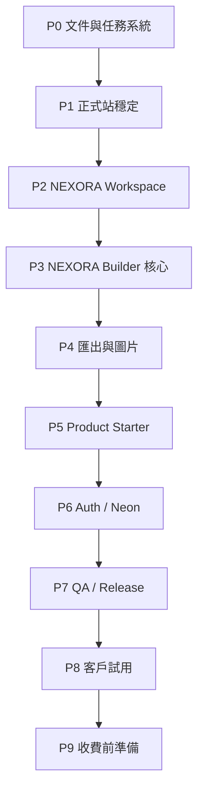

# NEXORA Platform Launch Plan

更新日期：2026-06-28

本文件是 NEXORA 平台級架構與上線任務計畫。Product Page Starter 的任務池使用 `PS-*`，本文件使用 `NX-*`，避免商品頁功能與平台架構混在一起。

目前 Product Page Starter 任務池範圍為 `PS-001` 到 `PS-018`，詳見 `docs/product-page-starter-task-inventory.md`。

## 1. 產品上線目標

NEXORA 要從目前可用的單一 Builder 工具，逐步變成可控、可測、可交付客戶使用的 SaaS 平台。

第一階段上線標準：

- 使用者可以登入。
- 使用者可以進入 NEXORA Workspace。
- NEXORA Builder 可建立、編輯、匯出活動頁與商品頁。
- 專案可在本機瀏覽器記憶，並可用 `.cmb` 匯入匯出備份。
- CMS 貼碼、ZIP、電子報匯出穩定。
- 帳號與 session 存 Neon。
- 專案與圖片暫不存 Neon。
- 正式站可由 Vercel 部署與回滾。

## 2. 架構原則

### 2.1 當前資料責任

| 資料 | 儲存位置 | 原因 |
|---|---|---|
| 帳號 | Neon `users` | 登入與使用權 |
| Session | Neon `sessions` | HttpOnly cookie 驗證 |
| 專案資料 | localStorage + `.cmb` | 低成本、避免雲端專案複雜度 |
| 上傳圖片 | IndexedDB + `.cmb` / ZIP `images/` | 不把圖片塞進資料庫 |
| CMS 圖片 | 外部圖片網址 | 貼碼情境最穩 |

### 2.2 暫不做

- 雲端專案同步。
- 圖片雲端素材庫。
- 付款。
- 權限等級。
- 註冊流程。
- 忘記密碼。
- 多人協作。
- AI 自動生成。

### 2.3 必須先驗錯再推進

每個任務必須具備：

- Scope
- Non-scope
- Impacted files
- Acceptance
- Validation commands
- Commit
- 是否 Push

## 3. 上線階段



## Phase P0. 文件與任務系統

### NX-001：平台文件索引整理

Goal：讓後續 ChatGPT / Codex 能快速理解 NEXORA 全貌。

Scope：

- 建立平台級 launch plan。
- 確認 `site-architecture`、`operations-runbook`、`module-taxonomy`、`product-page-starter` 文件互相有索引。

Non-scope：

- 不改功能。

Impact：

- `docs/nexora-platform-launch-plan.md`
- `docs/site-architecture.md`

Acceptance：

- 文件能說明目前平台資料儲存、登入、匯出與上線流程。
- 沒有 TODO/TBD/未定類占位。

Status：完成於本文件。

### NX-002：建立全平台 Task Inventory 規則

Goal：建立平台級任務執行規範，讓未來不是靠聊天記憶推進。

Scope：

- 定義 `NX-*` 任務格式。
- 定義每次完成回報格式。
- 定義驗證命令選用規則。

Non-scope：

- 不取代 Product Starter 的 `PS-*`。

Impact：

- `docs/nexora-platform-launch-plan.md`

Acceptance：

- 任務格式可直接交給 Codex 執行。

Status：完成於本文件。

## Phase P1. 正式站穩定

### NX-003：正式站 smoke test

Goal：確認 Vercel 正式站目前可進入、可登入、可開 Builder。

Scope：

- 檢查正式站首頁。
- 檢查登入 API。
- 檢查 Workspace。
- 檢查 Builder 入口。

Non-scope：

- 不修 UI 細節。
- 不改資料庫。

Impact：

- 無或 `docs/operations-runbook.md`

Acceptance：

- 正式站 HTTP 正常。
- 測試帳號可登入。
- 登入後可看到 NEXORA Builder。

Validation：

```bash
npm run build
npm run verify:auth-foundation
npm run verify:workshop-demo
```

Status：本機驗證完成；正式站 HTTP 檢查待可解析 DNS 的環境補驗。

2026-06-28 驗證結果：

- `npm run build`：通過。
- `npm run verify:auth-foundation`：通過。
- `npm run verify:workshop-demo`：通過。
- `curl https://campaignbuilder-coral.vercel.app/`：目前本機 shell 回傳 `Could not resolve host`，需改由瀏覽器或可正常 DNS 解析的環境補驗正式站首頁、登入與 Builder 入口。

### NX-004：Vercel 部署與回滾流程驗證

Goal：確保正式站壞掉時能快速回復。

Scope：

- 確認 GitHub push 會觸發 Vercel deploy。
- 確認 Vercel dashboard 可找到最新 deployment。
- 文件化 rollback 步驟。

Non-scope：

- 不購買 Pro。
- 不改 domain。

Impact：

- `docs/operations-runbook.md`

Acceptance：

- Runbook 有部署、redeploy、rollback 步驟。

Status：完成於目前工作分支。

2026-06-28 驗證結果：

- 先補 `verify:workspace-content` 紅燈測試，確認舊 `Campaign Builder` 主文案會被擋下。
- `npm run verify:workspace-content`：通過。
- `npm run verify:workshop-demo`：通過。
- `npm run verify:nexora-brand`：通過。
- `npm run build`：通過。
- Workspace 首頁、設定與多語系工具主名已統一為 `NEXORA Builder`。
- Builder 專用的「匯入專案檔 / 新增活動頁」仍只在 `workspaceSection === 'builder'` 顯示。

## Phase P2. NEXORA Workspace

### NX-005：Workspace 導航結構定案

Goal：確認登入後的主介面不是只服務 Builder，而是可承接未來工具。

Scope：

- 左側 app bar 定義。
- 首頁、專案、NEXORA Builder、設定的責任明確。
- 其他選單不顯示 Builder 專屬「新增活動頁 / 匯入專案」。

Non-scope：

- 不新增真正多工具。

Impact：

- `app/page.tsx`
- `docs/site-architecture.md`

Acceptance：

- 首頁與 Builder 不黏在一起。
- 只有 Builder context 顯示 Builder 操作。

Validation：

```bash
npm run verify:workspace-content
npm run build
```

Status：待做。

### NX-006：Workspace 空狀態與工具卡

Goal：讓使用者登入後知道現在能做什麼。

Scope：

- NEXORA Builder 工具卡。
- 專案卡預覽。
- demo 素材區。
- 未開放工具顯示準備中但不跑版。

Non-scope：

- 不做真素材庫。

Impact：

- `app/page.tsx`
- `components/*`

Acceptance：

- 首頁清楚呈現 NEXORA Builder 是目前主要工具。
- 未開放工具不造成誤導。

Status：待做。

## Phase P3. NEXORA Builder 核心

### NX-007：模組分類與順序驗證

Goal：確保左側模組分類符合目前定位。

Scope：

- General、Campaign、Product、Brand 分類順序。
- KV 與 KV 輪播上下相鄰。
- 移除重複模組。

Non-scope：

- 不新增模組功能。

Impact：

- `data/moduleSchemas.ts`
- `components/editor/ModuleLibrary.tsx`
- `docs/module-taxonomy.md`

Acceptance：

- 沒有 FAQ 重複。
- Product 模組不與 Campaign 模組重複。

Validation：

```bash
npm run verify:module-taxonomy
npm run verify:product-mvp-modules
```

Status：待做。

### NX-008：全站 UI / 模組 UI QA

Goal：確保 NEXORA 介面與模組預覽達到商業平台標準。

Scope：

- 登入頁。
- Workspace。
- Builder shell。
- 左側模組庫。
- 右側 Inspector。
- Preview canvas。
- Product modules。

Non-scope：

- 不引入外部 design system。

Impact：

- `app/page.tsx`
- `components/editor/*`
- `modules/preview/*`

Acceptance：

- PC / M 不跑版。
- 色盤 popover 不超出畫面。
- 工具列與面板沒有文字溢出。

Validation：

```bash
npm run verify:design-system
npm run verify:color-popover
npm run verify:desktop-canvas
npm run build
```

Status：待做。

## Phase P4. 匯出與圖片

### NX-009：CMS 貼碼匯出驗證

Goal：確保 CMS 使用者仍以貼碼為主，不輸出 base64 圖片爆字。

Scope：

- HTML / CSS / JS 分頁。
- 本地圖片提示改用圖片網址。
- Product modules 匯出完整。

Non-scope：

- 不新增 CMS 專屬 adapter。

Impact：

- `components/editor/ExportModal.tsx`
- `lib/export/*`
- `modules/exporters/*`

Acceptance：

- 貼碼不含超長 base64。
- 匯出視覺與預覽接近。

Validation：

```bash
npm run verify:cms-consistency
npm run verify:export-modal
```

Status：待做。

### NX-010：ZIP 與 `.cmb` 圖片完整性驗證

Goal：確認上傳圖片的使用者能靠 ZIP / `.cmb` 完成交付與備份。

Scope：

- ZIP 輸出 `images/`。
- `.cmb` 包含圖片。
- 匯入 `.cmb` 後可重新預覽。

Non-scope：

- 不做圖片雲端。
- 不把圖片寫入 Neon。

Impact：

- `lib/projects/*`
- `lib/assets/localImageStore.ts`
- `lib/export/*`

Acceptance：

- 圖片不進 localStorage。
- 圖片不進 Neon。
- `.cmb` 可跨瀏覽器手動移轉。

Validation：

```bash
npm run verify:local-image-store
npm run verify:project-package
```

Status：待做。

## Phase P5. Product Starter

### NX-011：Product Starter 任務池執行

Goal：依 `PS-*` 任務池逐步補齊商品頁生成器。

Scope：

- 從 `PS-003` 開始往下執行。
- 每次只做一個 `PS-*`。
- 每次更新 `docs/product-page-starter-task-inventory.md` 狀態。

Non-scope：

- 不把 `PS-*` 混進 `NX-*`。

Impact：

- `docs/product-page-starter-task-inventory.md`
- Product Starter 相關程式。

Acceptance：

- 每個 PS Task 都有 commit 與驗證結果。

Status：待做。

## Phase P6. Auth / Neon

### NX-012：帳號資料與 session QA

Goal：確認帳號系統足夠支援少量受邀使用者。

Scope：

- 登入。
- 登出。
- `remember 30 days`。
- inactive 帳號不可登入。

Non-scope：

- 不做註冊。
- 不做忘記密碼。
- 不做權限等級。

Impact：

- `app/api/auth/*`
- `lib/auth/*`
- `lib/db/neon.ts`

Acceptance：

- 測試帳號可登入。
- 停用帳號不可登入。
- session 過期處理正常。

Validation：

```bash
npm run verify:auth-foundation
npm run build
```

Status：待做。

### NX-013：帳號管理 runbook

Goal：讓你可以管理 10 位 user，而不用每次靠臨時 SQL。

Scope：

- 新增帳號流程。
- 停用帳號流程。
- 重設密碼流程。
- 密碼不可明碼保存。

Non-scope：

- 不做後台 UI。

Impact：

- `docs/operations-runbook.md`
- 可選新增 scripts，但需另開 Task。

Acceptance：

- 文件可讓你照步驟新增、停用、重設帳號。

Status：待做。

## Phase P7. QA / Release

### NX-014：正式上線 QA checklist

Goal：建立每次推正式站前都能照表跑的檢查。

Scope：

- Login。
- Workspace。
- Builder。
- Product Starter。
- 圖片上傳。
- CMS / ZIP / `.cmb`。
- Vercel deploy。

Non-scope：

- 不要求全自動 E2E。

Impact：

- `docs/nexora-release-checklist.md`

Acceptance：

- 每一項都有 pass / fail / note。
- 客戶試用前可照表完成。

Status：待做。

### NX-015：錯誤與回滾演練

Goal：確保正式站壞掉時有明確處理步驟。

Scope：

- 登入壞掉。
- Builder blank page。
- 圖片上傳壞掉。
- 匯出壞掉。
- Vercel deploy 失敗。

Non-scope：

- 不接監控平台。

Impact：

- `docs/operations-runbook.md`

Acceptance：

- 每種錯誤有排查順序與回滾方式。

Status：待做。

## Phase P8. 客戶試用

### NX-016：受邀測試版本文案與限制

Goal：讓客戶知道目前是受邀測試版，以及專案儲存位置。

Scope：

- 登入頁文案。
- Workspace 提示。
- 專案儲存提示。
- 圖片使用提示。

Non-scope：

- 不做付費牆。

Impact：

- `app/page.tsx`
- `docs/operations-runbook.md`

Acceptance：

- 使用者知道專案目前儲存在本瀏覽器。
- 使用者知道可用 `.cmb` 備份。

Status：待做。

### NX-017：客戶試用回饋表

Goal：讓試用不是只靠口頭回饋，而有固定收集欄位。

Scope：

- 建立回饋問題清單。
- 包含操作困難、缺少模組、匯出問題、視覺滿意度。

Non-scope：

- 不做線上表單系統。

Impact：

- `docs/customer-trial-feedback.md`

Acceptance：

- 可直接貼給客戶或內部測試者填寫。

Status：待做。

## Phase P9. 收費前準備

### NX-018：收費前功能邊界

Goal：明確定義月費 300 / user 時，客戶實際買到什麼。

Scope：

- 可用工具。
- 專案儲存方式。
- 匯出能力。
- 支援範圍。
- 不包含的服務。

Non-scope：

- 不做付款。
- 不做合約文件。

Impact：

- `docs/pricing-readiness.md`

Acceptance：

- 可以清楚對客戶說明目前方案。

Status：待做。

### NX-019：雲端專案評估

Goal：決定何時把專案資料從本機推進到 Neon。

Scope：

- 評估 projects table。
- 評估專案大小限制。
- 評估圖片仍不雲端化的限制。
- 評估跨裝置同步需求。

Non-scope：

- 不立刻實作雲端專案。

Impact：

- `docs/vercel-database-cost-risk-notes.md`
- `docs/site-architecture.md`

Acceptance：

- 有明確 go / no-go 條件。

Status：待做。

### NX-020：圖片雲端評估

Goal：決定是否需要素材庫或雲端圖床。

Scope：

- 評估 Vercel Blob、S3、Cloudflare R2、Supabase Storage。
- 評估每月成本與流量風險。
- 評估 CMS 貼碼是否需要雲端圖片網址。

Non-scope：

- 不立刻接 storage。

Impact：

- `docs/vercel-database-cost-risk-notes.md`

Acceptance：

- 有成本區間與上線條件。

Status：待做。

## 4. 固定完成回報格式

每完成一個 `NX-*` 或 `PS-*` 任務，回報格式固定如下：

```text
Task:
Commit:
Pushed:
Files changed:
Summary:
Validation commands:
Validation results:
Unfinished items:
Non-scope touched:
Human confirmation needed:
Next suggested task:
```

## 5. 當前建議執行順序

目前建議順序：

1. `NX-003`：正式站 smoke test。
2. `NX-005`：Workspace 導航結構定案。
3. `NX-009`：CMS 貼碼匯出驗證。
4. `NX-010`：ZIP 與 `.cmb` 圖片完整性驗證。
5. `PS-003`：Product Starter 建立前欄位完整度提示。
6. `NX-014`：正式上線 QA checklist。

原因：

- 先確保正式站與核心匯出穩定。
- 再強化 Product Starter。
- 最後建立上線前固定 QA。
