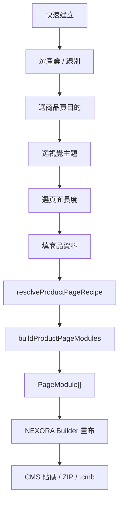

# NEXORA Builder Product Page Starter Spec

更新日期：2026-06-28

## 1. 功能定位

「快速建立」是 NEXORA Builder 的商品頁快速生成流程。對外名稱使用 Quick Builder / 快速建立；內部規格仍以 Product Page Starter 表示這套 recipe generator。

它不是另一套 Builder，也不是固定模板庫。它的責任是把使用者輸入的商品資料，依照產業、商品頁目的、視覺主題與頁面長度，轉成一組可編輯的 NEXORA Builder 模組。

產生後仍回到既有畫布，使用者可以繼續拖拉、刪除、複製、改文案、換圖片、調色，並使用既有 CMS 貼碼、ZIP、`.cmb` 匯出流程。

## 2. 產品目標

### 核心目標

- 讓沒有程式與設計背景的行銷、營運、電商 PM 可以快速產出商品頁初稿。
- 讓不同產業與不同商品線別有不同內容重點，不會所有頁面長一樣。
- 保留 Builder 的可編輯性，不把使用者鎖死在固定模板。
- 建立可擴充的產業、頁面目的、視覺主題、模組配方架構。

### 非目標

- 第一版不做 AI 自動生成文案。
- 第一版不做雲端素材庫。
- 第一版不做雲端專案同步。
- 第一版不做每個產業的完整專屬模板庫。
- 第一版不新增另一套匯出系統。

## 3. 核心概念

Product Page Starter 由四層決策組成。

| 層級 | 作用 | 範例 |
|---|---|---|
| Industry 產業 / 線別 | 決定要問哪些欄位、預設內容重點 | 清潔用品、美妝保養、食品飲品、家電 3C、服飾配件、電商綜合 |
| Product Goal 商品頁目的 | 決定頁面結構與模組順序 | 爆品銷售、新品上市、功效說明、情境導購、比較說服、組合促購 |
| Visual Theme 視覺主題 | 決定色彩、質感、間距、卡片、CTA、hover | 清爽潔淨、高級精品、強促銷、專業科技、溫暖生活、極簡電商 |
| Page Length 頁面長度 | 決定模組數量 | 快速版、標準版、完整版 |

這四層組合後，產生頁面配方。

```text
industry + goal + theme + length = page recipe
page recipe + product input = PageModule[]
```

## 4. 使用者流程

### Step 1. 選擇商品產業 / 線別

使用者選擇商品屬性，不直接選模板。

MVP 支援：

- 清潔用品
- 美妝保養
- 電商綜合

後續擴充：

- 食品飲品
- 生活用品
- 家電 3C
- 服飾配件
- 母嬰寵物

### Step 2. 選擇商品頁目的

使用者回答「這頁主要要完成什麼任務」。

MVP 支援：

- 爆品銷售：強化價格、利益點與購買 CTA。
- 新品上市：強化視覺形象、核心特色與品牌感。
- 比較說服：強化差異、使用前後、比較表。
- 情境導購：強化生活情境、使用場景、適用對象。

後續擴充：

- 功效說明
- 成分安心
- 組合促購
- 品牌形象

### Step 3. 選擇視覺主題

MVP 支援：

- 清爽潔淨：藍白、透明感、適合清潔用品與生活用品。
- 高級精品：低飽和、留白、適合美妝保養與高單價商品。
- 強促銷：高對比、價格標籤、適合檔期與爆品活動。
- 極簡電商：白底、商品突出、適合多線別電商商品頁。

後續擴充：

- 專業科技
- 溫暖生活
- 天然植萃
- 年輕潮流

### Step 4. 選擇頁面長度

| 長度 | 模組數 | 適用情境 |
|---|---:|---|
| 快速版 | 5 個左右 | 快速上架、促銷檔期、小商品 |
| 標準版 | 8 個左右 | 一般商品頁 |
| 完整版 | 12 個左右 | 新品上市、品牌主推、需完整說服 |

### Step 5. 輸入商品資料

欄位分為共用欄位與產業欄位。共用欄位必填優先，產業欄位可收合為進階資料。

### Step 6. 產生頁面

系統根據四層決策產生 PageModule[]，並新增到目前畫布。產生後不再鎖定模板，使用者可以用既有 Builder 操作繼續編輯。

## 5. 資料欄位設計

### 5.1 共用欄位

| 欄位 | 用途 |
|---|---|
| brand | 品牌名稱 |
| productName | 商品名稱 |
| category | 商品分類 |
| mainImage | 商品主圖，建議 1000 x 1000 去背 PNG |
| mobileImage | M 端商品圖，可選 |
| backgroundImage | KV 或情境背景圖 |
| headline | 商品頁主標 |
| subtitle | 副標 |
| description | 商品描述 |
| benefitOne / Two / Three | 三個核心賣點 |
| originalPrice | 原價 |
| salePrice | 特價 |
| ctaText | CTA 文字 |
| ctaLink | CTA 連結 |
| faqItems | 常見問題 |

### 5.2 清潔用品欄位

| 欄位 | 用途 |
|---|---|
| useScenarios | 廚房、浴室、衣物、地板等使用場景 |
| cleaningEffects | 去污、除菌、除臭、防霉、柔順 |
| scent | 香味 |
| volume | 容量 |
| ingredients | 成分 |
| safetyClaims | 無磷、無螢光劑、親膚、寵物友善 |
| beforeAfter | 使用前後差異 |
| certifications | 檢驗或認證 |

### 5.3 美妝保養欄位

| 欄位 | 用途 |
|---|---|
| skinType | 適用膚質 |
| effectClaims | 保濕、修護、亮白、抗老等功效 |
| ingredients | 成分 |
| usageOrder | 使用順序 |
| usageCycle | 使用週期 |
| beforeAfter | 使用前後 |
| certifications | 檢測、認證、評價 |

### 5.4 電商綜合欄位

| 欄位 | 用途 |
|---|---|
| sellingPoints | 商品特色 |
| specs | 規格 |
| targetAudience | 適用對象 |
| useScenarios | 使用情境 |
| bundleOffer | 組合優惠 |
| relatedProducts | 相關商品 |
| shippingOrWarranty | 配送、保固、售後說明 |

### 5.5 後續產業欄位

| 產業 | 主要欄位 |
|---|---|
| 食品飲品 | 口味、規格、成分、產地、保存方式、食用情境、營養標示 |
| 家電 3C | 規格、功能、使用情境、保固、比較表、技術特色 |
| 服飾配件 | 材質、尺寸、顏色、穿搭情境、洗滌方式、尺碼表 |
| 母嬰寵物 | 適用年齡/對象、安全性、材質、使用方式、注意事項 |

## 6. 頁面配方

### 6.1 爆品銷售

適合折扣、主推商品、檔期活動。

標準版模組：

1. `product-showcase`：商品 Hero
2. `anchor-nav`：錨點導覽
3. `product-benefits`：核心賣點
4. `product-features`：商品特色
5. `product-scenes`：商品情境
6. `product-comparison`：使用前後或差異比較
7. `faq`：商品 FAQ
8. `product-purchase`：購買 CTA / 推薦組合

### 6.2 新品上市

適合新品、品牌感商品、主形象頁。

標準版模組：

1. `product-showcase`：視覺 Hero
2. `title`：新品定位
3. `product-scenes`：情境展示
4. `product-features`：特色介紹
5. `product-info`：成分、規格或技術特色
6. `product-proof`：認證、評價或品牌保證
7. `faq`：常見問題
8. `product-purchase`：購買 CTA

### 6.3 比較說服

適合需要說明差異、教育使用者、取代競品的商品。

標準版模組：

1. `product-showcase`：問題與解法 Hero
2. `product-benefits`：痛點解法
3. `product-comparison`：商品比較 / 使用前後
4. `product-info`：規格或技術特色
5. `product-steps`：使用步驟
6. `product-proof`：信任證明
7. `faq`：疑慮處理
8. `product-purchase`：購買 CTA

### 6.4 情境導購

適合生活用品、清潔用品、服飾、食品與多情境商品。

標準版模組：

1. `product-showcase`：情境 Hero
2. `product-scenes`：適用場景
3. `product-features`：商品特色
4. `product-steps`：使用方式
5. `product-info`：商品資訊
6. `product-proof`：評價或保證
7. `faq`：常見問題
8. `product-purchase`：購買 CTA / 相關商品

## 7. 產業與目的組合範例

### 清潔用品 + 爆品銷售

- 內容重點：去污、除菌、使用前後、適用場景、容量、促銷。
- 推薦主題：清爽潔淨、強促銷。
- 主要模組：Hero、核心賣點、使用前後、適用場景、使用步驟、FAQ、CTA。

### 美妝保養 + 新品上市

- 內容重點：成分、膚質、功效、質感、使用方式、評價。
- 推薦主題：高級精品、天然植萃。
- 主要模組：Hero、功效亮點、成分介紹、使用情境、認證評價、CTA。

### 電商綜合 + 強促銷

- 內容重點：價格、優惠、組合、相關商品、配送或售後。
- 推薦主題：強促銷、極簡電商。
- 主要模組：促銷 Hero、核心利益、推薦組合、商品比較、商品列表、FAQ、CTA。

### 家電 3C + 比較說服

- 內容重點：規格、功能、技術特色、比較表、保固。
- 推薦主題：專業科技、極簡電商。
- 主要模組：Hero、技術特色、功能比較、規格表、使用情境、保固、CTA。

## 8. 模組與 Style 關係

Product Page Starter 不應該為每個視覺變體新增模組。原則如下：

- 模組負責內容結構。
- Style 負責視覺呈現。
- Theme 負責整頁視覺語言。
- Recipe 負責模組組合與順序。

例如：

```text
商品特色 product-features
  Style A: 四宮格
  Style B: 六宮格
  Style C: Icon + 文字
  Style D: 卡片式

大圖展示 product-showcase
  Style A: 上下留白
  Style B: 左右排版
  Style C: 精品風
```

Notes:

- 大圖展示不提供滿版形象，避免和 KV / 商品情境重疊。
- 舊資料若仍帶有 `full-bleed`，系統會自動轉成上下留白。
- 推薦組合匯出與預覽需一致，bundle style 固定輸出前三品。

## 9. MVP 範圍

### MVP 支援

- Industry：清潔用品、美妝保養、電商綜合。
- Goal：爆品銷售、新品上市、比較說服、情境導購。
- Theme：清爽潔淨、高級精品、強促銷、極簡電商。
- Length：快速版、標準版、完整版。
- Output：轉成既有 PageModule[]。
- Editing：回到既有 Builder 畫布編輯。
- Export：沿用 CMS 貼碼、ZIP、`.cmb`。

### MVP 不支援

- AI 自動產文。
- 產業資料庫。
- 雲端素材庫。
- 雲端專案同步。
- 使用者自訂 Recipe 儲存到雲端。
- 付款、權限等級、團隊協作。

## 10. 資料模型建議

```ts
type ProductIndustry =
  | 'cleaning'
  | 'beauty'
  | 'ecommerce'
  | 'food'
  | 'electronics'
  | 'fashion'
  | 'baby-pet';

type ProductGoal =
  | 'sales'
  | 'launch'
  | 'education'
  | 'comparison'
  | 'scenario'
  | 'bundle'
  | 'brand';

type ProductTheme =
  | 'fresh-clean'
  | 'luxury'
  | 'promo'
  | 'minimal-commerce'
  | 'tech'
  | 'warm-life'
  | 'natural'
  | 'youth';

type ProductPageLength = 'short' | 'standard' | 'full';

interface ProductPageStarterInput {
  industry: ProductIndustry;
  goal: ProductGoal;
  theme: ProductTheme;
  length: ProductPageLength;
  common: CommonProductFields;
  industryFields: Record<string, string | string[]>;
}

interface ProductPageRecipe {
  id: string;
  industry: ProductIndustry | 'any';
  goal: ProductGoal;
  theme: ProductTheme;
  length: ProductPageLength;
  modules: ProductPageRecipeModule[];
}
```

## 11. 產生流程資料流



## 12. 使用體驗原則

- 不讓使用者先面對大量模板。
- 用「你要怎麼賣這個商品」取代「選模板」。
- 表單先問必要欄位，進階欄位收合。
- 每一步都要有預設推薦，避免 user 卡住。
- 產生後要清楚告知：這只是初稿，可回畫布自由調整。
- 同一產業內要透過 Goal、Theme、Style 組合產生差異，避免頁面長一樣。

## 13. 驗收標準

- 清潔用品、美妝保養、電商綜合三種產業可選。
- 每個產業至少能搭配四種商品頁目的。
- 每個商品頁目的會產生不同模組順序。
- 每個視覺主題會套用不同色彩與模組 style 預設。
- 快速版、標準版、完整版產生的模組數不同。
- 產生後模組仍能被拖拉、編輯、刪除、複製。
- 匯出 CMS 貼碼、ZIP、`.cmb` 不需新增另一套流程。
- 不新增與既有 Product 模組重複的模組。
