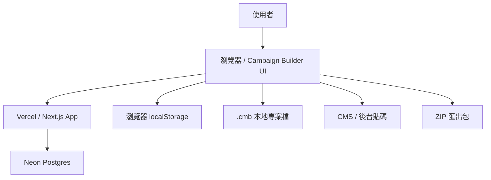
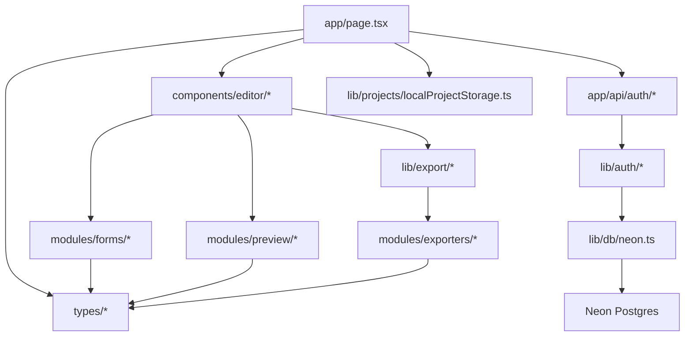
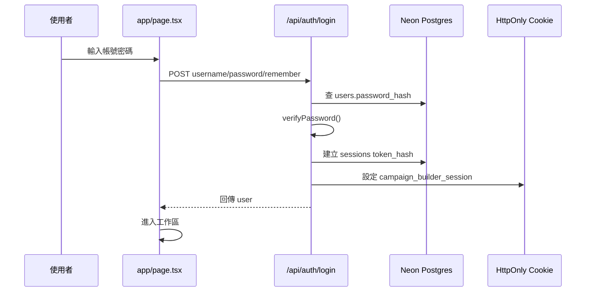
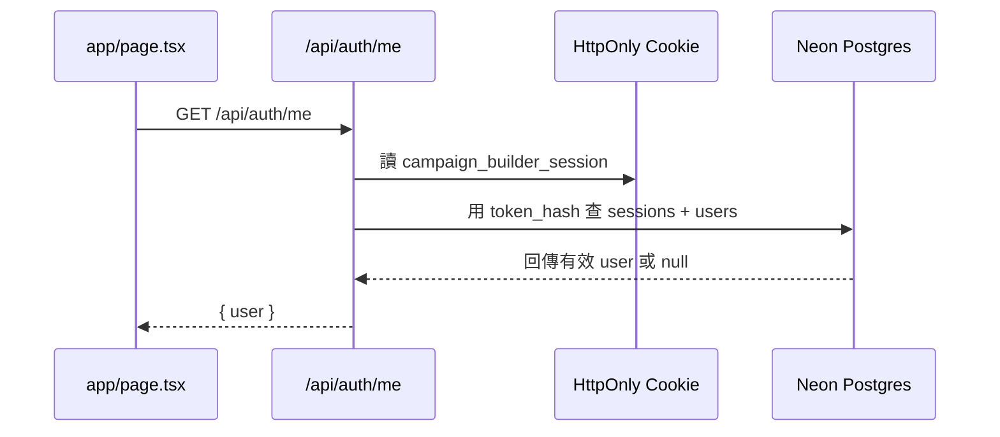
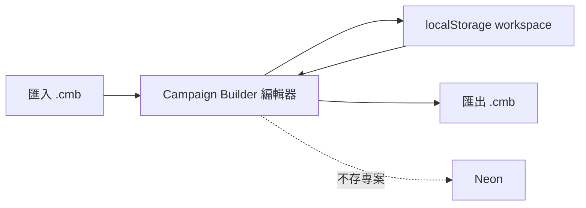
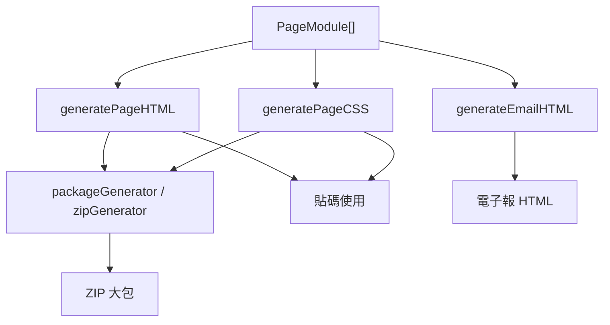
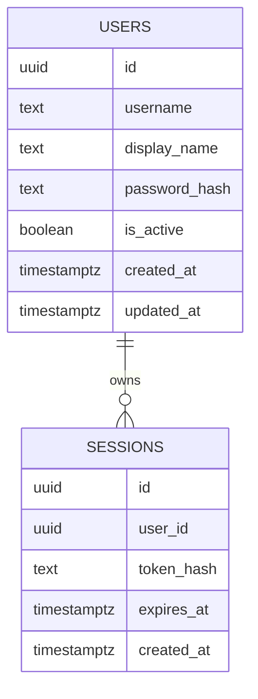

# Campaign Builder 網站架構圖

更新日期：2026-06-27

這份文件記錄目前 Campaign Builder 的網站架構、資料流與主要模組。之後新增登入、資料庫、匯出、專案檔、圖片策略或新工具時，必須同步更新本文件。

## 產品定位

Campaign Builder 是一個給行銷、營運人員使用的活動頁模組產生工具。

目前產品策略：

- 帳號：用 Neon 儲存帳號與登入 session，作為使用權入口。
- 專案：仍以本機瀏覽器記憶與 `.cmb` 專案檔為主，不先做雲端專案同步。
- 圖片：
  - 圖片連結可直接輸出到 CMS 貼碼。
  - 上傳圖片主要用於 ZIP 打包，輸出到 `images/`。
  - 暫時不做圖片雲端。

## 高階架構



## 應用分層



## 主要檔案責任

| 路徑 | 責任 |
|---|---|
| `app/page.tsx` | 主要產品入口、登入狀態、工作區、專案列表、編輯器組合 |
| `app/api/auth/login/route.ts` | 登入 API，驗證 Neon 內的帳號密碼 |
| `app/api/auth/logout/route.ts` | 登出 API，清除 session |
| `app/api/auth/me/route.ts` | 查詢目前登入 user |
| `lib/db/neon.ts` | Neon Postgres 連線 |
| `lib/auth/password.ts` | 密碼 hash 與驗證 |
| `lib/auth/session.ts` | session token、cookie、目前 user |
| `lib/projects/localProjectStorage.ts` | 本機專案、自動儲存、`.cmb` 匯入匯出 |
| `components/editor/ModuleLibrary.tsx` | 左側模組庫 |
| `components/editor/PreviewCanvas.tsx` | 中央畫布與排序 |
| `components/editor/InspectorPanel.tsx` | 右側設定面板 |
| `components/editor/ExportModal.tsx` | 貼碼、ZIP、電子報匯出 |
| `modules/forms/*` | 各活動頁模組的設定表單 |
| `modules/preview/*` | 各活動頁模組的即時預覽 |
| `modules/exporters/*` | 各活動頁模組的 HTML 匯出 |
| `lib/export/*` | HTML/CSS/JS/ZIP 組合與輸出 |
| `types/modules.ts` | 活動頁模組型別 |
| `types/emailModules.ts` | 電子報模組型別 |
| `types/project.ts` | 專案與 workspace 型別 |

## 登入流程



## Session 流程



## 專案資料策略

目前專案不跟帳號雲端同步。帳號只代表使用權，專案仍跟本機走。



### localStorage

儲存 key：

```text
campaign-builder-project-workspace-v1
```

內容：

- 專案名稱
- 模組資料
- 顏色設定
- 圖片網址
- 上傳圖片的 base64 暫存資料
- 電子報模組
- 目前選取狀態

### .cmb 專案檔

`.cmb` 是本地專案檔，使用 JSON 格式。

用途：

- 使用者自行備份
- 換電腦時手動匯入
- 更接近桌面工具或剪映工程檔的使用邏輯

原則：

- `.cmb` 可以包含上傳圖片的 base64。
- `.cmb` 不會上傳到 Neon。
- `.cmb` 不會自動同步。

## 匯出流程



## 圖片策略

| 圖片來源 | 儲存位置 | 匯出方式 | 是否吃 Neon 容量 |
|---|---|---|---|
| 圖片連結 | 專案資料文字欄位 | CMS 貼碼直接使用 URL | 低，用量可忽略 |
| 上傳圖片 | localStorage / `.cmb` | ZIP 匯出時放入 `images/` | 不吃 Neon |
| 雲端圖片 | 暫不支援 | 暫不支援 | 暫不支援 |

目前不應把上傳圖片 base64 存到 Neon。

## Neon 資料表

目前 Neon 只做帳號與 session。



Seed 帳號：

```text
client01 / cb2026
client02 / cb2026
...
client10 / cb2026
```

密碼儲存方式：

- 不存明碼
- 使用 `scrypt` hash
- 驗證時使用 `timingSafeEqual`

## 環境變數

本機：

```text
.env.local
DATABASE_URL=postgresql://...
```

正式 Vercel：

```text
DATABASE_URL
```

注意：

- `.env.local` 已被 `.gitignore` 排除。
- Neon 密碼不可提交到 Git。
- 若密碼曾公開貼出，完成設定後應 rotate password。

## 驗證腳本

| 指令 | 用途 |
|---|---|
| `npm run verify:auth-foundation` | 檢查 Neon auth 基礎架構 |
| `npm run verify:project-memory` | 檢查本機專案與 `.cmb` 專案檔 |
| `npm run verify:workshop-demo` | 檢查工作區入口與專案列表 |
| `npm run build` | 檢查正式建置 |
| `npm run typecheck` | 檢查 TypeScript |

## 後續更新規則

以下情況必須更新本文件：

1. 新增頁面或主要工作區入口
2. 新增 API route
3. 改變登入/session 流程
4. 改變專案資料儲存位置
5. 開始把專案存到 Neon
6. 開始支援圖片雲端
7. 新增匯出格式
8. 新增資料表
9. 新增付費、權限或方案限制
10. 新增會影響 Vercel 或 Neon 成本的功能

## 目前刻意不做

- 專案雲端同步
- 圖片雲端
- 付款
- 權限等級
- 忘記密碼
- 註冊流程
- 多人協作
- AI 生成

這些功能上線前，請先閱讀：

- `docs/vercel-database-cost-risk-notes.md`
