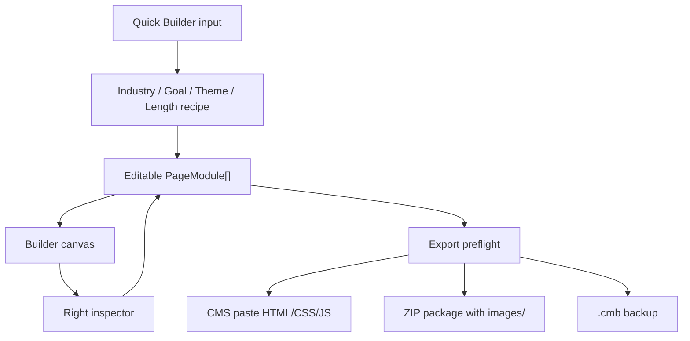

# NEXORA Builder Quality Sprint Design

Date: 2026-06-30

## 1. Goal

This sprint deepens NEXORA Builder before opening another major tool.

The goal is to make the current Builder feel closer to a commercial product:

- Easier right-side editing.
- Clearer module and style differences.
- Safer CMS / ZIP export.
- Stronger Quick Builder output.
- Better visual quality across General, Campaign, and Product modules.

This is not a rebuild. The current module system, export system, local project model, and NEXORA Workspace remain the foundation.

## 2. Product Positioning

NEXORA is a digital creation workspace. NEXORA Builder is the first production tool inside it.

For this sprint, Builder should support two creation modes:

1. Manual Build：user adds modules and edits them directly.
2. Quick Builder：user fills product/page inputs, then Builder generates editable modules.

Both modes must end in the same canvas and same module model. Quick Builder is a starter, not a separate template editor.

## 3. Non-goals

This sprint does not include:

- AI copy generation.
- Cloud project sync.
- Cloud asset library.
- Payment, plans, permission levels, or registration.
- Replacing IndexedDB image handling.
- Replacing the export architecture.
- Creating a second editor for product pages.
- Adding modules only because a visual treatment looks different.

## 4. Core Principles

### 4.1 Module vs Style

Module = content structure and business purpose.

Style = layout, hierarchy, visual treatment, spacing, animation, and presentation.

Do not create duplicate modules only to make the same content look different. Create or keep a module only when it needs a different editor model, different data, or different export behavior.

### 4.2 Style Must Be Meaningfully Different

A style option is valid only if it changes at least two of these:

- Layout structure.
- Visual hierarchy.
- Image usage.
- Content density.
- Card/background treatment.
- Mobile behavior.
- Motion or interaction state.

If two styles only change spacing or copy labels, merge or rename them.

### 4.3 Inspector Should Reduce Cognitive Load

The right-side setting panel should not show every field with equal weight.

Fields should be grouped into:

- Content：titles, descriptions, product names, prices, FAQ items.
- Images：PC/M images, dimension hints, upload/link controls.
- Style：colors, typography emphasis, module style, layout variants.
- Action：CTA text, links, button color/text color.
- Advanced：anchor name, custom options, less-used settings.
- Check：warnings for missing images, dimensions, links, or export issues.

Inactive or irrelevant settings should be hidden or collapsed.

### 4.4 Export Must Warn Before It Fails

Export should not rely on the user discovering broken output after copy/paste.

Before CMS paste or ZIP download, Builder should run a preflight check and show:

- Errors：must fix before export.
- Warnings：export allowed, but likely wrong.
- Suggestions：quality recommendations.

### 4.5 Every Completed Item Updates Docs

A task is not complete until its status and validation are recorded in the related document.

At minimum, update one of:

- `docs/nexora-platform-launch-plan.md`
- `docs/product-page-starter-task-inventory.md`
- `docs/module-taxonomy.md`
- this sprint spec or its future task inventory
- release / QA checklist documents

## 5. Recommended Approach

### Approach A：Visual polish first

Pros:

- Fastest visible improvement.
- Good for first impression.

Cons:

- Risk of making weak workflows look better without solving them.
- Could create more style confusion if taxonomy is not cleaned first.

### Approach B：Workflow safety first

Pros:

- Reduces user confusion and broken exports.
- Makes trial safer.
- Builds stronger foundation for future visual work.

Cons:

- Less immediately flashy.

### Approach C：Quick Builder expansion first

Pros:

- Makes product-page creation feel stronger.
- Helps new industries.

Cons:

- If inspector and styles remain unclear, generated pages still feel hard to edit.

### Recommendation

Use Approach B with selected visual upgrades in parallel.

Order:

1. Right inspector information architecture.
2. Export preflight checker.
3. Quick Builder category expansion.
4. Module style differentiation.
5. Full visual polish pass.

This creates the least risk and the highest trust for customer trial.

## 6. Feature Design

### 6.1 Right Inspector Refresh

Current problem:

- Many fields are shown as one long list.
- Users cannot quickly tell which settings affect content, image, style, or export safety.
- Advanced settings and frequently used settings have similar weight.

Design:

- Add sectioned editing inside the right panel.
- Start with simple section headers or segmented tabs. Avoid a heavy modal.
- Use progressive disclosure: show the most common fields first, collapse advanced fields.
- Keep module title and selected module type visible.
- Add a compact status row for missing required assets or links.

Initial grouping:

| Group | Content |
|---|---|
| Content | copy, titles, product text, prices, FAQ rows |
| Images | image upload/link fields, PC/M pairing, dimensions |
| Style | module style, color, layout, alignment |
| Action | CTA text, link, button colors |
| Advanced | anchor name, extra export-safe fields |
| Check | local warnings for this module |

Acceptance:

- A user can edit the main content of a selected module without scanning unrelated style and advanced fields.
- A module with missing image/link shows an obvious but non-blocking warning.
- Existing module data remains backward compatible.

### 6.2 Export Preflight Checker

Current problem:

- User can export even when images are missing, local images are incompatible with CMS paste, CTA links are empty, or dimensions are wrong.
- CMS paste and ZIP have different image rules but are not always clear at export time.

Design:

Create a preflight model that checks the current project before export.

Checks:

| Type | Rule |
|---|---|
| Error | CMS paste contains uploaded local image instead of external URL |
| Error | Required image is missing |
| Error | Required CTA link is empty when CTA is visible |
| Error | Invalid image dimension if dimension metadata exists |
| Warning | Placeholder image still in module |
| Warning | Anchor button points to a missing module |
| Warning | Module has visible button with `#` link |
| Warning | PC image exists but M image missing and not marked same-as-PC |
| Warning | ZIP export has image data that cannot be mapped to `images/` |
| Suggestion | Page has no anchor navigation on long pages |
| Suggestion | Page has no final purchase CTA |

Export mode behavior:

- CMS Paste：must prefer external image URLs.
- ZIP：can use uploaded images and output `images/...`.
- `.cmb`：must include project data and local image package references.

Acceptance:

- Export modal shows counts and exact modules that need attention.
- User can still copy/export when only warnings exist.
- Errors clearly explain what to fix.

### 6.3 Quick Builder 2.0

Current problem:

- Industry options are too few.
- Pages may feel repetitive if industry decides too much.
- Quick Builder is useful, but not yet broad enough for cleaning, ecommerce, and future clients.

Design:

Quick Builder should use layered decisions:

1. Industry：what kind of product language and required fields are needed.
2. Page goal：what the page is trying to do.
3. Visual theme：how the page should feel.
4. Page length：how many sections are generated.
5. Product data：actual copy, price, specs, images.

Industries:

| Industry | Purpose |
|---|---|
| Cleaning 清潔用品 | ingredient, scenario, effect, usage proof |
| Beauty 美妝保養 | texture, benefit, ingredient, before/after |
| Ecommerce 電商綜合 | price, bundle, specs, related products |
| Food & Beverage 食品飲品 | flavor, origin, nutrition, serving scenario |
| 3C / Home Appliance 3C 家電 | spec, comparison, usage scene, warranty |
| Fashion & Accessories 服飾配件 | styling, material, detail, fit |
| Mom / Baby / Pet 親子寵物 | safety, certification, use scenario, care |
| Lifestyle / Home 居家生活 | scene, before/after, material, size |

MVP expansion order:

1. Food & Beverage.
2. 3C / Home Appliance.
3. Fashion & Accessories.

The remaining industries are reserved after the first three pass QA.

Acceptance:

- Quick Builder can generate at least six distinct outputs by mixing industry, goal, theme, and length.
- Generated modules remain fully editable through the normal inspector.
- No generated section uses a one-off non-editable template.

### 6.4 Module Style Differentiation

Current problem:

- Some style options feel visually identical.
- User cannot tell why to choose one style over another.

Design:

Run a style audit on Product, Campaign, and General modules.

Each style needs:

- Clear use case label.
- Visible layout difference.
- Distinct mobile behavior if relevant.
- Export CSS class and preview class parity.
- One-sentence editor hint.

Priority modules:

| Module | Problem to solve |
|---|---|
| 商品特色 | 四宮格 vs 卡片式 must differ in density and card hierarchy |
| 大圖展示 | 左右排版 vs 精品風 must feel structurally different |
| 商品資訊 | 成分 / 技術 / 規格 / 內容物 must map to different content presentation |
| 商品比較 | Mobile table must not break; column labels must remain visible |
| 信任證明 | 評價 / 保證 / 認證 must not look like the same card |
| 購買轉換 | 推薦組合 vs 相關商品 must have different buying intent |

Acceptance:

- A non-technical user can tell why each style exists without reading implementation details.
- Mobile preview does not lose important labels.
- Export output matches canvas preview.

### 6.5 Visual Quality Pass

Current problem:

- Some modules are functional but still feel plain.
- The site UI has improved, but Builder output needs stronger product-design quality.

Design direction:

- Keep CMS-safe CSS.
- Use glass / liquid-like treatment carefully for editor UI and selected premium styles.
- Avoid overly heavy animations that CMS may strip or slow down.
- Use tighter typography hierarchy.
- Use more intentional spacing, shadows, borders, and image framing.
- Strengthen hover states for preview/export where possible.

Module visual rules:

- Hero/KV can be immersive and full-width.
- Product modules should feel editorial and sales-oriented, not only grid-based.
- Campaign modules should feel compact, scannable, and promo-driven.
- General modules should be neutral and reusable.
- Buttons default to dark background and white text unless user overrides.

Acceptance:

- General, Campaign, and Product modules each have a clearer visual personality.
- The visual upgrade does not break CMS paste, ZIP export, or mobile layout.
- Product pages created by Quick Builder no longer feel like only placeholder blocks.

### 6.6 Assets Page Repositioning

Current problem:

- The current Assets section is weak because there is no real cloud asset library yet.
- It risks promising a feature that is not ready.

Design:

Rename or reposition the section as a lightweight resource area until cloud assets exist.

Options:

1. Keep `素材` but describe it as `範例素材與規格`.
2. Rename to `資源` and include size tables, demo assets, export guide, and checklist.
3. Hide from main navigation until there is a real asset library.

Recommendation:

Use option 2. `資源` is broader and honest. It can include:

- Image size guide.
- Product page examples.
- CMS paste guide.
- ZIP image package guide.
- Demo asset checklist.

Acceptance:

- User does not confuse the section with a real uploaded cloud asset library.
- It still helps trial users understand image specs and export rules.

## 7. Data Flow



## 8. Likely Impacted Files

| Area | Likely files |
|---|---|
| Right inspector | `components/editor/InspectorPanel.tsx`, `modules/forms/*`, `components/ui/FormField.tsx` |
| Export preflight | `components/editor/ExportModal.tsx`, `lib/export/*`, new `lib/export/preflight*` |
| Quick Builder | `components/editor/ProductBuildModal.tsx`, `lib/productBuilder/*`, `docs/product-page-starter-*` |
| Module styles | `modules/preview/*`, `modules/exporters/*`, `lib/export/cssGenerator.ts` |
| Module taxonomy | `docs/module-taxonomy.md` |
| Workspace resources | `app/page.tsx`, `docs/site-architecture.md` |
| Verification | `scripts/verify-*.mjs`, `package.json` |

## 9. Task Inventory

### BQ-001：Create Builder Quality Sprint docs

Goal：建立本 sprint 的正式設計與任務基準。

Scope：

- 新增 sprint spec。
- 記錄 scope / non-scope / approach / task inventory。

Non-scope：

- 不改產品功能。

Acceptance：

- Spec committed.
- No placeholders or contradictions.

Status：完成於本文件，commit 後以完成回報記錄實際 commit。

### BQ-002：Right inspector IA plan and status doc

Goal：定義右側設定的新資訊架構。

Scope：

- 盤點目前 module forms。
- 定義 section groups。
- 補 inspector QA checklist。

Non-scope：

- 不先重寫所有表單。

Acceptance：

- 每個模組欄位可歸類到 Content / Images / Style / Action / Advanced / Check。

Status：完成於 `docs/builder-inspector-ia.md`。已定義右側設定分組、全站設定歸屬、General / Campaign / Product 模組欄位 map、`BQ-003` UI shell 建議與 QA checklist。

### BQ-003：Right inspector grouped UI shell

Goal：讓右側設定先具備清楚分區。

Scope：

- 加入共用 section wrapper。
- 保留既有表單功能。
- 不破壞資料更新。

Acceptance：

- 選取任一模組時，右側不再是一整條無分區列表。

Status：完成第一階段。已新增共用 `FormSection`、錨點進階區、檢查區 shell，並套用到 KV、KV 輪播、商品列表、商品輪播、活動 Banner + 商品、單品主打、商品資訊與商品頁進階表單。後續低密度模組可在視覺 polish 任務中補齊。

### BQ-004：Image field status and dimension hints

Goal：讓圖片欄位清楚說明 PC/M、尺寸、CMS/ZIP差異。

Scope：

- 統一 image field warning copy。
- 顯示 local image / URL / same-as-PC 狀態。
- 背景圖 repeat-y 也納入上傳與規格提示。

Acceptance：

- 使用者可分辨 CMS 貼碼應用 URL，ZIP 可用上傳圖。

Status：完成第一階段。已新增圖片欄位狀態提示：本機上傳、圖片網址、尚未設定；補上 CMS 貼碼與 ZIP 圖片處理差異；全站背景圖 repeat-y 使用 background 模式並顯示 PC/M 裁切說明。

### BQ-005：Export preflight model

Goal：建立匯出前檢查資料模型。

Scope：

- 新增 checker function。
- 回傳 error / warning / suggestion。
- 規則支援 CMS / ZIP / `.cmb`。

Acceptance：

- 可用 script 對 demo project 跑檢查。

Status：完成第一階段。已新增 `lib/export/preflight.ts`，支援 CMS / ZIP / `.cmb` 模式，回傳 error / warning / suggestion 與 `hasErrors`。目前規則涵蓋：必填圖片缺漏、CMS 貼碼使用本機圖、CTA 連結缺漏、`#` placeholder、M 圖缺漏、錨點目標不存在、長頁缺錨點導覽、商品頁缺購買轉換。已新增 `npm run verify:export-preflight` 作為文件與資料模型驗證。

### BQ-006：Export preflight UI

Goal：在匯出視窗顯示檢查結果。

Scope：

- 顯示問題數量。
- 顯示受影響 module。
- 錯誤時引導回 canvas 修正。

Acceptance：

- 不再只能匯出後才發現破圖或缺 CTA。

Status：完成第一階段。匯出視窗已接上 `analyzeExportPreflight`，會依目前分頁顯示 CMS 貼碼或 ZIP 匯出的檢查結果，包含錯誤、警告、建議與無阻擋問題狀態。第一階段先提供摘要與前 6 筆問題清單，後續再補「點擊回到模組」與匯出阻擋策略。

### BQ-007：Quick Builder industry expansion

Goal：補強快速建立品類。

Scope：

- 新增 Food & Beverage、3C/Home Appliance、Fashion & Accessories。
- 每個產業要有不同 field emphasis、module recipe、default copy。

Non-scope：

- 不接 AI。
- 不新增雲端資料。

Acceptance：

- 至少三個新增產業可生成頁面。

Status：完成第一階段。快速建立已新增食品飲料、3C 家電、服飾配件，加上原有清潔用品、美妝保養、電商綜合共 6 個線別。每個線別皆有專屬預設品牌、品名、分類、主標、副標、詳情、賣點、情境、信任證明與 FAQ；切換產業仍保留價格、CTA 與圖片，避免 user 已輸入資料被覆蓋。

### BQ-008：Quick Builder output visual upgrade

Goal：讓快速建立生成頁更像設計稿，不只像模組堆疊。

Scope：

- 調整 recipe module order。
- 調整 theme-to-style mapping。
- 補 hero / product showcase / proof / purchase 的搭配邏輯。

Acceptance：

- Cleaning、Beauty、Ecommerce、新增產業生成結果肉眼可區分。

Status：完成第一階段。快速建立輸出與商品頁模組已補強視覺層次：Quick Builder 產生文案加入 visual hook、proof hook、conversion intent；商品展示新增玻璃浮標與環境面板；商品特色新增索引與紋理層；核心賣點新增訊號條；購買轉換新增光框層。預覽與匯出 HTML/CSS 已同步。

### BQ-009：Product style distinction audit

Goal：盤點 Product 模組 style 是否重複。

Scope：

- 逐一檢查 Product style。
- 記錄 merge / rename / redesign 建議。

Acceptance：

- 每個 style 都有明確用途與視覺差異。

### BQ-010：Product module visual upgrades

Goal：優先修正商品頁模組太陽春問題。

Scope：

- 商品特色。
- 大圖展示。
- 商品資訊。
- 商品比較。
- 信任證明。
- 購買轉換。

Acceptance：

- Preview and export output match.
- Mobile layout stable.

Status：完成第一階段。已先針對商品展示、商品特色、核心賣點、購買轉換補強視覺層次，並新增 `npm run verify:product-page-visual-upgrade` 鎖定預覽與匯出一致性。下一階段再處理商品情境、使用步驟、商品資訊與信任證明的更完整設計。

### BQ-011：General and Campaign module visual upgrades

Goal：讓活動頁與通用模組也提升，不只商品頁變漂亮。

Scope：

- KV / KV輪播。
- 標題。
- 圖文區塊。
- FAQ。
- Logo Wall。
- 商品列表 / 商品輪播。
- 活動 Banner + 商品。
- 單品主打。

Acceptance：

- 不破壞既有尺寸規格。
- 不讓 Campaign 模組變成 Product 模組重複品。

Status：完成第一階段。General / Campaign 模組已補強視覺層次：KV 與 KV 輪播新增深度層與玻璃框；標題、FAQ、Logo Wall 補上輕量視覺訊號；商品列表、商品輪播、活動 Banner + 商品、單品主打補上活動商品訊號與玻璃層。預覽與匯出 HTML/CSS 已同步，並新增 `npm run verify:general-campaign-visual-upgrade` 鎖定回歸。

### BQ-012：Resources page repositioning

Goal：處理素材區雞肋感。

Scope：

- 將 Assets 重新定位為 Resources / 資源。
- 補圖片規格、匯出指南、Demo 素材說明。

Non-scope：

- 不做雲端素材庫。

Acceptance：

- 使用者不會誤以為目前有雲端素材管理。

### BQ-013：Verification scripts and release checklist

Goal：補驗證，不讓品質只靠肉眼。

Scope：

- 新增或更新 verifier。
- 更新 release checklist。
- 記錄 manual QA cases。

Acceptance：

- Build and relevant verify scripts pass.
- Docs updated before commit.

## 10. Validation Plan

Minimum automated validation after implementation tasks:

```bash
npm run build
npm run verify:product-page-starter
npm run verify:product-style-distinction
npm run verify:product-starter-export-readiness
npm run verify:cms-consistency
npm run verify:export-modal
npm run verify:project-package
```

New scripts may be added as tasks land:

- `verify:builder-inspector-ia`
- `verify:export-preflight`
- `verify:quick-builder-industries`
- `verify:module-visual-rules`

Manual QA:

- Create one activity page manually.
- Create one product page with Quick Builder.
- Switch PC/M preview.
- Upload and link images.
- Export CMS paste.
- Export ZIP.
- Import/export `.cmb`.

## 11. Risks

| Risk | Mitigation |
|---|---|
| Scope too broad | Keep BQ tasks atomic and commit separately |
| Visual polish breaks export | Preview/export parity checks per module |
| Quick Builder produces repetitive pages | Mix industry, goal, theme, length, and module style |
| Inspector refactor breaks data editing | Preserve existing form data contracts first |
| CMS strips advanced effects | Keep effects CSS-only and safe; avoid required JS for decorative animation |
| Assets page over-promises | Reposition as Resources until cloud assets exist |

## 12. Completion Report Format

Each BQ task completion must report:

1. Task ID.
2. Files changed.
3. User-visible change.
4. Validation commands and result.
5. Docs updated.
6. Commit hash.
7. Remaining risk or next task.
